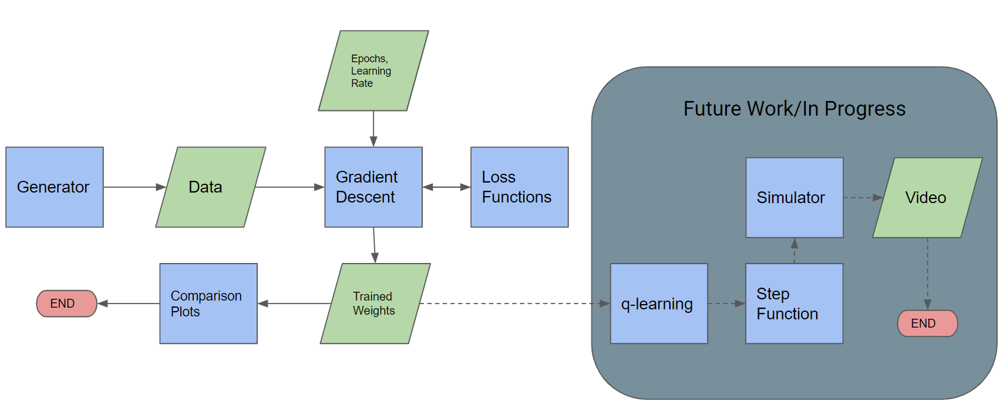

# Project: Learning State Representations for Multi-Agent Systems from Multi-Agent Priors
#### Team 5 - Learning by Exploiting Structure and Fundamental Knowledge
#### CogRob-Spring2023-MIT

### Requirements
1. Python3
2. Numpy
3. Matplotlib
4. Pandas
5. Please go through the README under implementations_nfq


## Introduction
The repository contains the guide and implementation of the code for the grand challenge project. 

For the project, we are learning the state representation for a multi-robot system in a grid world. The data flow and process is outlined in the figure below. 





The steps are as follows:
1. Generate the dataset
2. Train the mapping on the dataset using gradient descent
3. Generate plots to complete evaluation
4. [NOT OPERATIONAL] Peform Neural Fitted Q-Learning using the trained mapping

## Generating the dataset
The scenario for our multi-robot environment is as follows:

* Open grid — 2 agents, goals on opposing corners (they must swap locations)
* Grid size - 5x5
* Action space - [up, down, left, right]
* Rewards - log(distance from current location to goal location), at goal location +3

The dataset generator is called within the gradient descent, but can be run natively as well to print out a simple test. The dataset generator is hosted within the file `multi_agent_sim_data.py`. And the scenario is under the class `Two_Agent_Exchange_Location_Scenario`. The class is well documented for use and interpretation. 

To run the file and its simple test, simply execute
```
python3 multi_agent_sim_data.py --movements 20
```

which will generate 20 sequence of random steps for both the agents and print to the screen the first two movements. The initial location is fixed at [[0,0], [4,4] on the grid but can be changed from within the script. 

## Gradient Descent

The gradient descent is run through the file `gradient_descent.py`, it calls the dataset generator with the following parameters - 5x5 grid size and 400 images. This can be changed from within the script if needed. 
The gradient descent operation requires the user to input the number of epochs, learning rate and a file name to save the weights. An example run command is below

```
python3 gradient_descent.py --iterations 1000 --learning_rate 0.01 --weight_name save_weights_test.txt
```

After finishing the gradient descent the `weight_name` will save the mapping in the file name given by the user and `losses.txt` will save the losses from each epoch. 

We have already provided some weights we used in our report in the repo for use if needed. E.g. `sidddhant_weights_400img_1000epochs_0025lr_5x5grid.txt`


## Evaluating 

To run the evaluation you can simply run the `plots.py` file as
```
python3 plots.py
```
which will auto load the weights we have used to create the plots for the final report and show those. 

You can change the code easily in the script to load plots for the weights you saved. 

## Q-learning

To run the q-learning function run
```
python3 q_learning.py
```
Unfortunately, it doesn't converge and authors will work in the future to improve the script and functionality.

